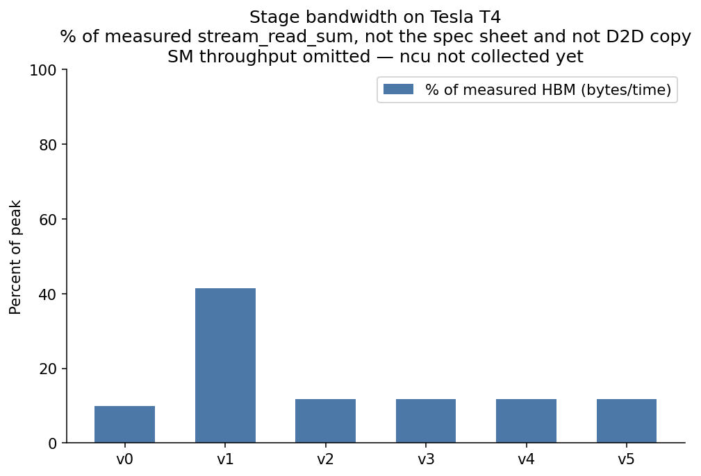
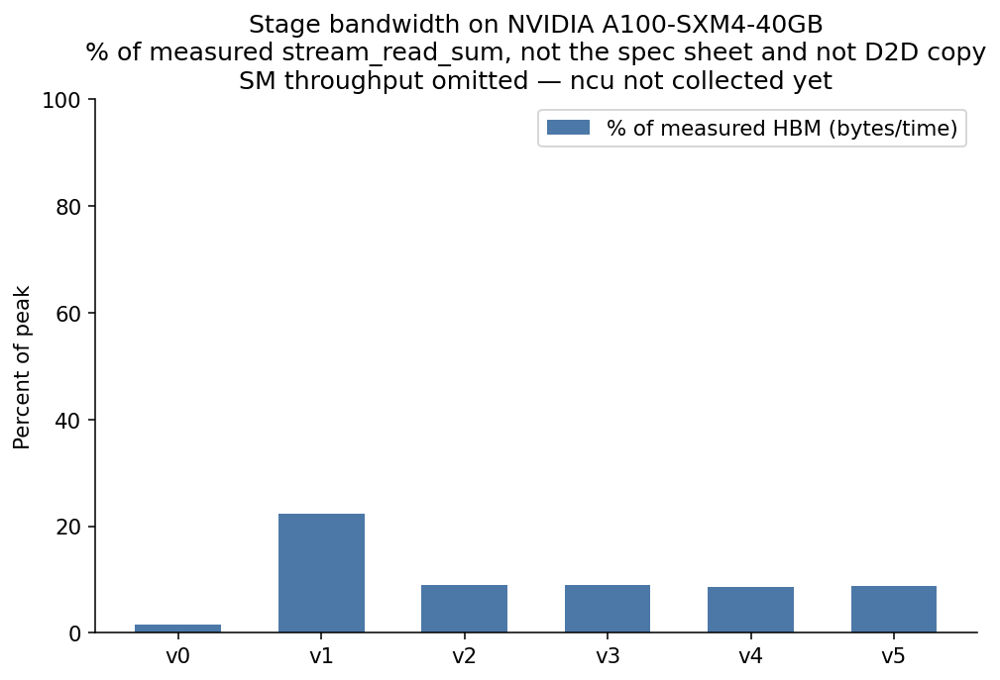
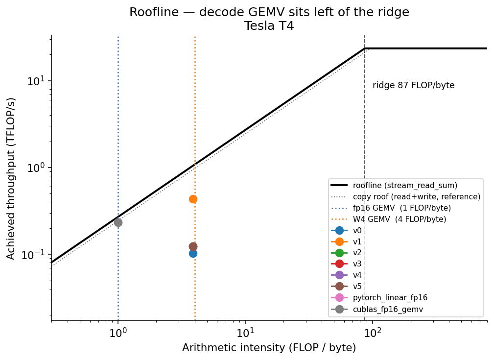
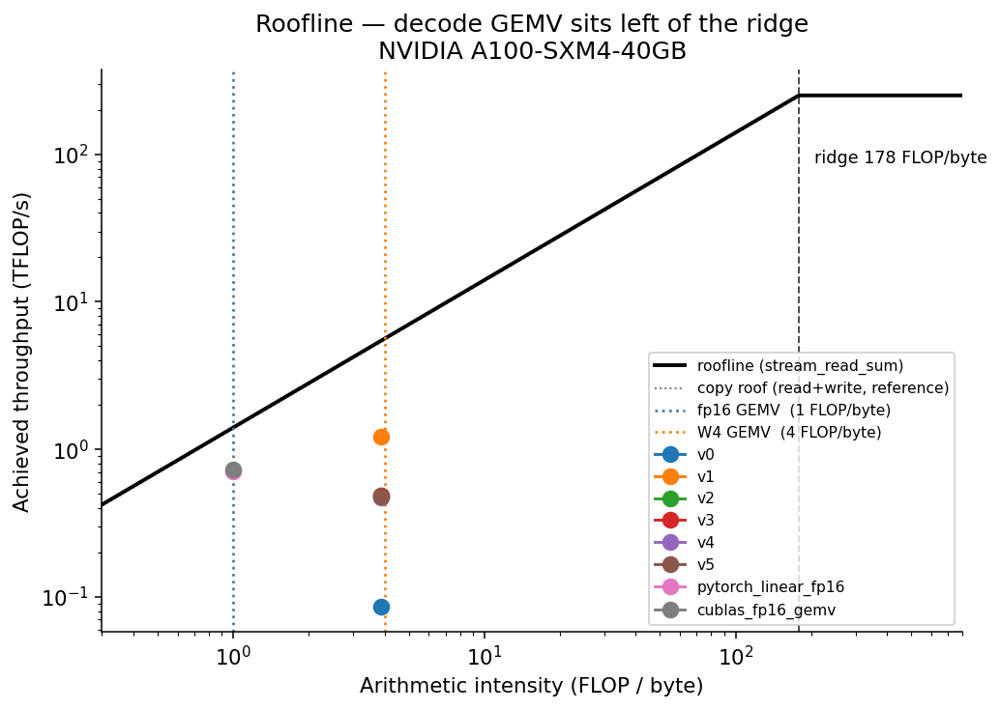
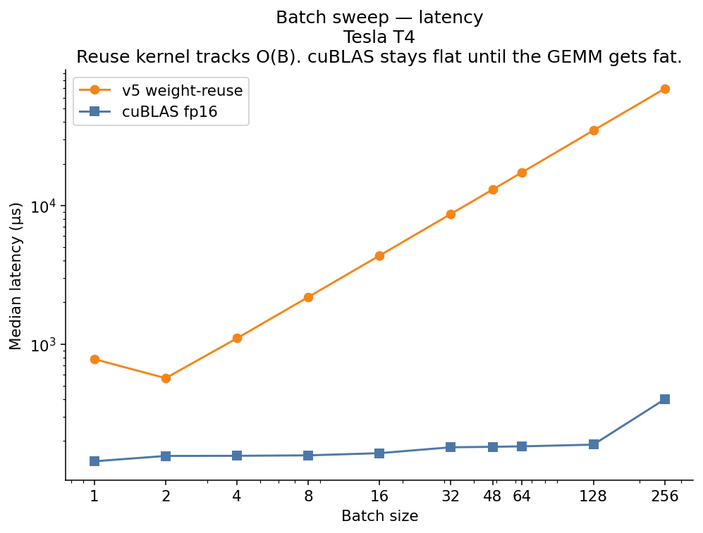
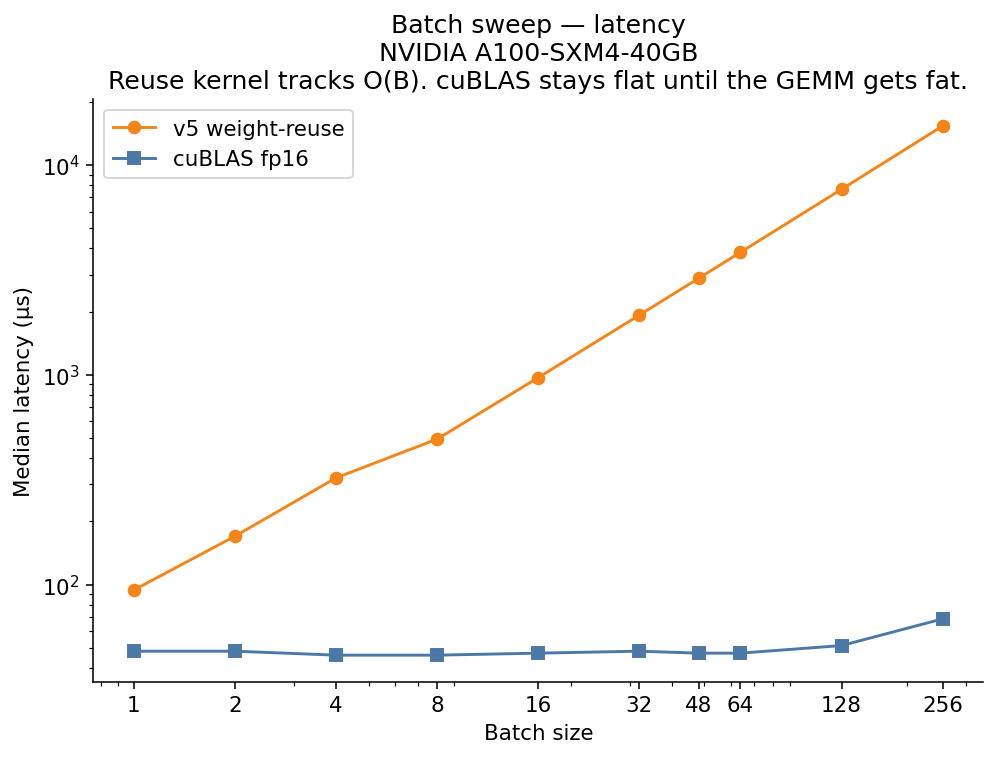

# decode-kernel

A hand-written **W4A16** GEMV for the LLM decode path: 4-bit grouped weights, fp16 activations, fused dequantization, never materializing the fp16 weight matrix.

The ceiling is HBM bandwidth, not tensor cores. That is the point.

---

## Findings (read this first)

**Tesla T4 and NVIDIA A100-SXM4-40GB, Modal, 2026-09-10.** Full tables in [`RESULTS.md`](RESULTS.md). Marlin and ncu were not collected (ncu is not available on Modal).

A decode GEMV reads each weight once and does one multiply-add:

| Weight format | Bytes / weight | FLOP / byte |
|---|---|---|
| fp16 | 2 | 1.0 |
| 4-bit | 0.5 | 4.0 (3.87 with scales + X + Y) |

HBM hit rates use a **read-only STREAM** roof (512 MB sum-reduction), not a device-to-device copy. Copy moves each byte twice; the GEMV does not. Copy is kept in the JSON as reference.

| Ceiling | Tesla T4 | A100-SXM4-40GB |
|---|---|---|
| STREAM copy (read+write) | 243 GB/s | 1380 GB/s |
| STREAM read (GEMV denom) | **270 GB/s** | **1406 GB/s** |
| STREAM write | 231 GB/s | 1452 GB/s |
| Read vs copy | +11% | +2% |
| cuBLAS fp16 GEMM 4096 | 23.5 TFLOP/s | 251 TFLOP/s |
| Ridge (read denom) | 87 FLOP/byte | 178 FLOP/byte |
| W4 GEMV vs ridge | 22× below | 46× below |

A100 write (1452) sitting above read (1406) is posted stores: the fill does not wait on a return path, unlike the reduction. The 3% gap is also inside run-to-run noise; neither figure is used as the GEMV denominator.

**v1 (warp-per-row) is the kernel.** v2–v5 regress on both GPUs. Device stamps confirm v0–v5 launch distinct code; matching v2/v3/v5 latency is a shared 32-wide unpack, not a dispatch bug.

| 4096×4096 B=1 | T4 | A100 |
|---|---|---|
| v1 | **77.5 µs, 41% of read HBM** | **27.6 µs, 22% of read HBM** |
| cuBLAS fp16 GEMV | 143 µs, 87% of read | 46 µs, 52% of read |
| v1 vs cuBLAS (cross-precision) | **1.84×** from 3.87× fewer bytes | **1.67×** from 3.87× fewer bytes |

A100 has **5.2×** the read bandwidth of T4; v1 is only **2.8×** faster. The prediction that %HBM would stay roughly constant **did not hold**. Running v1 at 11008 rows on A100 (matching T4's warps/SM) left %HBM at **23%**, so the gap is dequant/unpack, not too few warps. 4096×11008 on T4 still shows v1 at **41% of read** and **1.85×** vs cuBLAS — wider K does not change the bottleneck.

Predicted ~3.2× vs cuBLAS and 84% HBM at v5 were not reached. The residual is HBM efficiency (dequant / 32-wide unpack), not arithmetic intensity. The old 100% T4 cuBLAS figure was an artifact of measuring a read-only kernel against a copy roof.









**Batch sweep** ran on the v5 **weight-reuse** path, not on v1. That path is ~10× slower than v1 at T4 batch 1 and then tracks **O(B)** on both GPUs. cuBLAS stays flat into large batch. That is not a memory-to-compute crossover; it is instruction cost on re-dequant. SM vs DRAM crossing needs ncu, which Modal does not provide. No crossover batch is claimed.






---

## Why this kernel and not a GEMM

Do not write an fp16 GEMM and benchmark it against cuBLAS. cuBLAS uses tensor cores plus a decade of hand tuning. A solo kernel that reaches 41% of cuBLAS is a true result that reads as a failure.

A GEMV’s ceiling is HBM bandwidth. Bandwidth is a ceiling you can actually approach, because there is far less room for cleverness between you and the memory controller. v1 reached 41% of measured read-only HBM on Tesla T4 and 22% on A100-SXM4-40GB. cuBLAS fp16 GEMV reached 87% of the T4 read roof and 52% of A100 read at the same skinny shape. That gap is the work left, not a reason to switch to a GEMM.

Pick the kernel by where its ceiling is, not by how impressive it sounds.

W4A16 GEMV is also the actual decode kernel in TensorRT-LLM, vLLM, and SGLang.

**Not using tensor cores:** they accelerate compute. This kernel is nowhere near compute-bound, so they would not help. That is future work for the *prefill* side of the ridge, not a missed optimization here.

---

## Kernel stages

Each row is a separate kernel. The jumps and regressions are the result.

| Stage | What it does | What you should see |
|---|---|---|
| **v0** | One thread per output row, scalar loads | Correct, terrible. Adjacent threads hit different rows — uncoalesced. |
| **v1** | One warp per row, shuffle reduction | The large jump. Coalescing was the whole problem. |
| **v2** | `int4` / 128-bit packed-weight loads | **Regressed on T4.** 32-wide unpack lost the bandwidth v1 had. Coalesced; not a dispatch bug. |
| **v3** | Fused dequant in registers, group scales in smem | Same latency as v2. Same inner loop (`dequant_dot32`). Stamps are 2 vs 3. |
| **v4** | Split-K across the reduction dim | Slightly worse than v3 at batch 1 on T4 and A100. |
| **v5** | `launch_bounds`, `__ldg`, unroll | Same as v2/v3. Stamp is 5. The reuse sweep of this stage is O(B), not a crossover. |

The batch-size sweep uses a **weight-reuse** path (`reuse_weights=True`): each warp stages its packed row into shared memory once, then streams every batch item. Without that, re-reading W from HBM for every batch element keeps arithmetic intensity stuck at 4 FLOP/byte and the crossover never appears.

Format: symmetric signed 4-bit, group size 128, eight consecutive q-values packed low-nibble-first into int32. Accumulate fp16×fp16 into fp32.

---

## Correctness gate

Max absolute error against a PyTorch **fp32 dequantize-then-matmul of the same packed weights**, not against the original dense matrix. Quantization error is out of scope for the kernel test; rounding and reduction order are in scope.

Tolerance: **1e-2 max abs**. Justified because activations and scales enter the kernel as fp16 while the reference is fp32, and K is thousands of terms. Bitwise equality is not achievable and not claimed.

```bash
pytest tests/test_quantize.py -q          # CPU, packing format
pytest tests/test_correctness.py -q       # GPU, every stage
DK_FULL_TEST=1 DK_FULL_SHAPES=1 pytest tests/test_correctness.py
```

A fast kernel that is silently wrong is the common failure mode in this category. The gate runs in CI on the packing format, and on GPU in the Kaggle/A100 scripts.

---

## Measurement

```bash
python -m bench.ceilings                  # STREAM copy / read / write + cuBLAS GEMM
python -m bench.bench --shapes 4096x4096 --versions 0,1,2,3,4,5
python -m bench.bench --sweep --shapes 4096x4096
python -m bench.ncu_collect               # or --print-only if ncu is missing
python -m bench.apply_hit_rates           # recompute %HBM vs the read-only roof
python -m bench.plot
```

Establish ceilings first. Do not quote the spec sheet. Do not use a copy (read+write) as the GEMV roof.

Protocol: warmup 50, time 1000 CUDA events, median and IQR (never best-of), L2 emptied between iterations with a 64 MB fill. 4096×4096 fp16 weights are 33 MB — they miss T4 L2 (4 MB) and *fit* A100 L2 (40 MB). Flush or the A100 numbers are fiction. STREAM roofs use a 512 MB buffer so they miss A100 L2 as well.

Baselines, all four:

1. PyTorch `F.linear` fp16 — what a user would do
2. cuBLAS fp16 GEMV (`torch.mv` / `torch.mm`) — the strong same-shape baseline
3. Marlin / AWQ / bitsandbytes — the same-precision peer (optional install)
4. Our v0 — the internal delta

1 and 2 are cross-precision. 3 is the comparison that actually tests the kernel. Marlin was not installed on these runs, so that peer is absent — do not read the cuBLAS number as one.

Nsight Compute counters (the GPU equivalent of the `perf` work on the CPU decode engine):

`dram__bytes_read.sum`, `dram__bytes_write.sum`, `dram__throughput.avg.pct_of_peak_sustained_elapsed`, `sm__throughput.avg.pct_of_peak_sustained_elapsed`, `l1tex__t_sectors_pipe_lsu_mem_global_op_ld.sum`, `sm__warps_active.avg.pct_of_peak_sustained_active`, `smsp__inst_executed.sum`.

---

## GPU access

Develop on **Kaggle’s free T4**, or run the same harness on Modal without changing the local loop. Final numbers still want an A100. Report the SKU on every figure.

This laptop has a GTX 1650 (4 GB, ~128 GB/s spec). It is useful for compile checks, not for the headline tables.

```bash
# Local / Kaggle / Colab — unchanged
pip install -e . pytest matplotlib
pytest tests/ -q
bash scripts/run_all.sh
```

```bash
# Modal — alternate runner, same JSON contract
pip install modal
modal setup
modal run bench/modal_runner.py --gpu T4
modal run bench/modal_runner.py --gpu T4 --mode ceilings
modal run bench/modal_runner.py --gpu A100 --mode diag
modal run bench/modal_runner.py --gpu A100 --mode all
# or: DK_MODAL_GPU=A10G modal run bench/modal_runner.py
python -m bench.plot
```

Both paths write `bench/results/*.json` tagged with the GPU. T4 and A100 ceilings, stages, sweeps, stamps, and the A100 row-count diagnostic from Modal are in the tree. ncu is not available on Modal.

---

## Build

Linux, CUDA toolkit, PyTorch with CUDA:

```bash
pip install -e .
```

`setup.py` compiles `sm_75` (T4) through `sm_90` (H100) unless it can see the current GPU, in which case it builds just that arch. Override with `DK_CUDA_ARCH=75,80`. Skip the extension with `DK_SKIP_CUDA=1` (CPU packing tests only).

Shapes from real models: 4096×4096, 4096×11008, 4096×14336 (Llama 7B/8B attention and MLP projections).

---

## Layout

```
csrc/gemv_w4a16.cu     v0–v5 + weight-reuse path
python/decode_kernel/  quantize, reference, bindings
bench/                 ceilings, harness, ncu, plots, prediction.json
tests/                 packing + kernel correctness
```

Out of scope: training, tensor cores, activation quantization, multi-GPU, end-to-end model integration. Two half-measured kernels are worth less than one fully measured one.

License: MIT.
