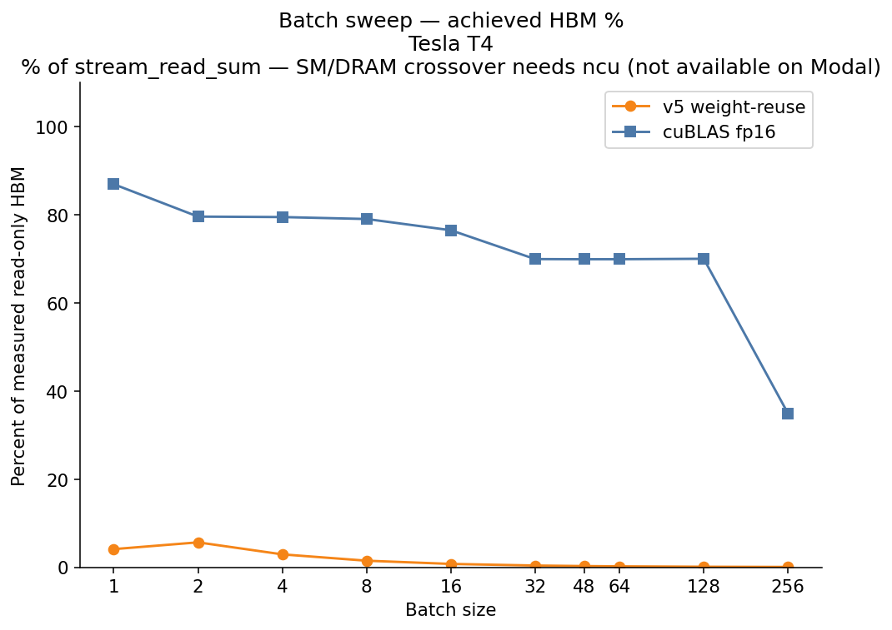
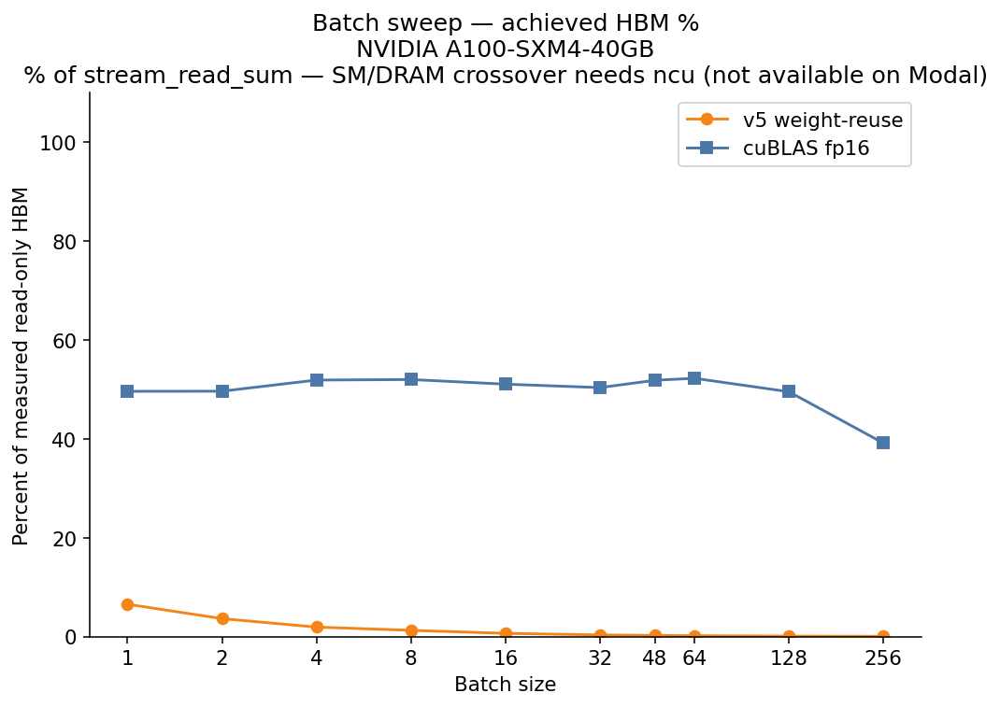

# Results

Every number names the GPU it was measured on. Nsight Compute was not collected (Modal/gVisor does not expose the counters). Marlin was not installed. 4096×14336 was not run.

Raw JSON: `bench/results/*.json`.

GEMV stage latencies were **not** rerun for this revision. STREAM ceilings, kernel stamps, and the A100 row-count diagnostic were measured on 2026-09-10. Hit rates below use the **read-only STREAM** figure as the denominator.

---

## Hardware

### Tesla T4 (Modal)

| Field | Value |
|---|---|
| SKU | Tesla T4, 15360 MiB, sm_75 |
| Runner | Modal, host `modal` (gVisor) |
| Driver | 580.95.05 |
| CUDA / PyTorch | image CUDA 12.4; `torch 2.5.1+cu124` |
| nvcc | `-O3 -arch=sm_75 -ccbin g++` |
| STREAM buffer | 512 MiB (past 4 MB L2) |
| HBM copy (read+write, factor 2) | **243.4 GB/s** (`d2d_copy`) |
| HBM read (sum-reduction, factor 1) | **270.1 GB/s** (`stream_read_sum`) — **GEMV denominator** |
| HBM write (fill, factor 1) | **230.9 GB/s** (`stream_write_fill`) |
| Read vs copy | **+11.0%** |
| Spec HBM | 320 GB/s → read reached 84% of spec |
| cuBLAS fp16 GEMM 4096×4096 | **23.54 TFLOP/s** |
| Ridge (read denom) | **87 FLOP/byte** |
| Ridge (copy, reference) | 97 FLOP/byte |
| Clocks locked | no |
| L2 | 4 MB |
| Date | 2026-09-10 |

### NVIDIA A100-SXM4-40GB (Modal)

| Field | Value |
|---|---|
| SKU | NVIDIA A100-SXM4-40GB, 40960 MiB, sm_80 |
| Runner | Modal, host `modal` (gVisor) |
| Driver | 580.95.05 |
| CUDA / PyTorch | image CUDA 12.4; `torch 2.5.1+cu124` |
| nvcc | `-O3 -arch=sm_80 -ccbin g++` |
| STREAM buffer | 512 MiB (past 40 MB L2) |
| HBM copy (read+write, factor 2) | **1379.7 GB/s** (`d2d_copy`) |
| HBM read (sum-reduction, factor 1) | **1405.6 GB/s** (`stream_read_sum`) — **GEMV denominator** |
| HBM write (fill, factor 1) | **1452.3 GB/s** (`stream_write_fill`) |
| Read vs copy | **+1.9%** |
| Spec HBM | 1555 GB/s → read reached 90% of spec |
| cuBLAS fp16 GEMM 4096×4096 | **250.9 TFLOP/s** |
| Ridge (read denom) | **178 FLOP/byte** |
| Ridge (copy, reference) | 182 FLOP/byte |
| Clocks locked | no |
| L2 | 40 MB |
| Date | 2026-09-10 |

A100 L2 is 40 MB. 4096×4096 fp16 weights are 33 MB and **fit**. Every timed GEMV iteration fills a 64 MB buffer. Skip that and the A100 stage table is cache-resident.

W4 GEMV arithmetic intensity is 3.87 FLOP/byte. That is **22× below the T4 read ridge** and **46× below the A100 read ridge**. Decode GEMV is not close to compute-bound on either GPU.

---

## Read-only roof vs copy roof

A device-to-device copy moves each byte twice (one read, one write). The GEMV reads packed weights and writes a tiny output vector, so it is read-dominated. Using copy as the GEMV roof understates bandwidth and overstates every hit rate. The tell on the previous revision was cuBLAS fp16 GEMV at **100% of T4 copy**, which is not an achievable claim for a read-dominated kernel against a read+write measurement.

STREAM probes (512 MB, grid-stride, eight independent accumulators on the read kernel, enough blocks to cover the SMs):

| GPU | copy | read | write | read / copy |
|---|---|---|---|---|
| Tesla T4 | 243.4 GB/s | **270.1 GB/s** | 230.9 GB/s | +11% |
| A100-SXM4-40GB | 1379.7 GB/s | **1405.6 GB/s** | 1452.3 GB/s | +2% |

The read roof did **not** land 15–40% above copy. On A100 that band is physically out of reach: copy is already 89% of the 1555 GB/s spec sheet, so a unidirectional probe cannot sit 15% above it. T4 has more headroom (copy was 76% of spec); read came in at +11%, which is the correction that matters. A100 write (1452 GB/s) sitting above read (1406) is posted stores — the fill does not wait on a return path — and 3% is also inside session noise. All GEMV `% HBM` figures below use **read**. Copy is kept in the JSON as `hbm_copy` for reference.

cuBLAS fp16 GEMV on T4 is **87% of read**, not 100%. That is under the ~90% flag line, so it is reported. It is no longer presented as hitting the roof.

---

## Dispatch: v2 / v3 / v5 identical latencies

v2, v3, and v5 reported 275–280 µs on T4 (and 69 µs on A100). That looked like a version flag that never reached the launch.

Each kernel now writes a device stamp (`0..5`, reuse `15`, v1 multiwarp `12`/`14`). `bench/stamp_check.py` on both GPUs:

```
v0=0 v1=1 v2=2 v3=3 v4=4 v5=5  reuse=15  v1_wpr2=12  v1_wpr4=14
```

The Python `version` argument reaches a distinct `__global__`. There is no fallthrough in the dispatch switch. **This was not a dispatch bug.** The stage table is unchanged.

v3 and v5 reuse v2's inner loop (`dequant_dot32` on `int4` loads, 32 weights/thread). Same memory/compute shape → same latency is expected.

v2 at 31 GB/s vs v1 at 112 GB/s is also not a coalescing break. Lane `v` loads `int4` at `row_w + (v << 2)`: consecutive lanes issue consecutive 16-byte transactions. `x` is 32 fp16s at `k0 = v << 5`. The regression is the 32-wide unpack versus v1's 8-wide `dequant_dot8`.

---

## Pre-registered prediction vs what happened

From `bench/prediction.json`, written before timing:

| Prediction | T4 | A100 |
|---|---|---|
| ~3.0–3.4× vs cuBLAS fp16 from 4× fewer bytes | **1.84×** (4096×4096 v1) | **1.67×** (v1) |
| ~84% of measured HBM at v5 | **41% of read at v1**; v5 is 12% | **22% of read at v1**; v5 is 9% |
| % HBM roughly constant across GPUs | 41% T4 → 22% A100 | **did not hold** |
| Memory→compute crossover at batch 32–64 | sweep ran on **v5 reuse**, not v1 | no SM/DRAM crossing without ncu |

The prediction that the kernel is bandwidth-bound is still right (AI ≪ ridge on both GPUs). The prediction that we would sit near the HBM roof, and that %HBM would travel with the GPU, is not.

---

## Methodology

- Warmup 50, 1000 timed iters on stages; sweep used 200 iters
- CUDA events, median and IQR
- 64 MB L2 flush between GEMV iterations
- W4 bytes = packed W + scales + X + Y
- `% HBM` = those bytes / time / **read-only STREAM GB/s**
- Cross-precision baselines labeled in JSON
- Marlin skipped
- ncu not collected
- Kernel stamp recorded after each launch (`launched_version` in new benches)

Two T4 sessions: 4096×4096 stages from 09:14 (JSON later overwritten by the 4096×11008 run). Those 4096×4096 **medians** are kept below; `% HBM` is recomputed against this revision's 270.1 GB/s read roof. GEMV kernels were not retimed.

---

## Tesla T4 — batch 1, 4096×4096

% of measured **read-only STREAM 270.1 GB/s**. Copy (243.4 GB/s) in parentheses for reference. Latencies unchanged from the first T4 run.

| Impl | median µs | IQR µs | GB/s | % of read | % of copy |
|---|---|---|---|---|---|
| v0 naive | 314.4 | 109.8 | 27.6 | 10.2% | 11.3% |
| **v1 warp-per-row** | **77.5** | **0.54** | **111.8** | **41.4%** | 45.9% |
| v2 vectorized int4 | 274.9 | 0.96 | 31.5 | 11.7% | 12.9% |
| v3 fused dequant | 275.8 | 0.99 | 31.4 | 11.6% | 12.9% |
| v4 split-K (4) | 279.8 | 1.02 | 31.0 | 11.5% | 12.7% |
| v5 tuned | 275.6 | 0.99 | 31.5 | 11.7% | 12.9% |
| cuBLAS fp16 GEMV | 142.8 | 1.82 | 235.2 | **87.1%** | 96.6% |
| PyTorch `F.linear` fp16 | 142.9 | 1.76 | 235.0 | 87.0% | 96.5% |
| Marlin W4A16 | skipped | — | — | — | — |

v1 is **1.84× faster than cuBLAS fp16**, from **3.87× fewer bytes**. cuBLAS is 87% of the read roof — reported, not flagged.

---

## Tesla T4 — batch 1, 4096×11008

Llama 7B MLP width. Same 4096 rows as above (this is not a parallelism test). % of **270.1 GB/s read**.

| Impl | median µs | IQR µs | GB/s | % of read |
|---|---|---|---|---|
| v0 | 874.5 | 6.1 | 26.6 | 9.9% |
| **v1** | **208.4** | **2.2** | **111.7** | **41.4%** |
| v2 | 732.3 | 1.3 | 31.8 | 11.8% |
| v3 | 734.0 | 1.0 | 31.7 | 11.7% |
| v4 | 733.2 | 0.2 | 31.8 | 11.8% |
| v5 | 733.8 | 1.0 | 31.7 | 11.7% |
| cuBLAS fp16 GEMV | 384.6 | 3.4 | 234.5 | 86.8% |
| `F.linear` fp16 | 384.4 | 2.8 | 234.7 | 86.9% |

v1 vs cuBLAS: **1.85×**. % of read matches 4096×4096. Wider K does not change the bottleneck.

4096×14336 was not run.


---

## A100-SXM4-40GB — batch 1, 4096×4096

% of **1405.6 GB/s read**. Copy is 1379.7 GB/s, so % of copy is almost the same number.

| Impl | median µs | IQR µs | GB/s | % of read | % of copy |
|---|---|---|---|---|---|
| v0 naive | 391.2 | 4.1 | 22.2 | 1.6% | 1.6% |
| **v1 warp-per-row** | **27.6** | **2.0** | **313.5** | **22.3%** | 22.7% |
| v2 vectorized int4 | 68.6 | 0.0 | 126.3 | 9.0% | 9.2% |
| v3 fused dequant | 68.6 | 2.0 | 126.3 | 9.0% | 9.2% |
| v4 split-K (4) | 71.7 | 1.0 | 120.9 | 8.6% | 8.8% |
| v5 tuned | 69.6 | 1.0 | 124.5 | 8.9% | 9.0% |
| cuBLAS fp16 GEMV | 46.1 | 1.0 | 728.5 | 51.8% | 52.8% |
| `F.linear` fp16 | 47.1 | 1.0 | 712.7 | 50.7% | 51.7% |
| Marlin | skipped | — | — | — | — |

v1 is **1.67× faster than cuBLAS fp16** on this A100, still from moving 3.87× fewer bytes.


### Dual-GPU read

| | T4 | A100 | A100 / T4 |
|---|---|---|---|
| Measured read HBM | 270 GB/s | 1406 GB/s | **5.2×** |
| Measured copy HBM | 243 GB/s | 1380 GB/s | 5.7× |
| v1 latency, 4096×4096 B=1 | 77.5 µs | 27.6 µs | **2.8× faster** |
| v1 % of read HBM | 41% | 22% | fell |
| cuBLAS fp16 GEMV latency | 143 µs | 46 µs | 3.1× faster |
| cuBLAS % of read HBM | 87% | 52% | also fell |

The clean claim — “%HBM stays constant, µs drops with bandwidth” — **does not hold for this kernel**. A100 has 5.2× the read bandwidth; v1 only got 2.8× lower latency. The extra HBM is there; v1 cannot eat it.

v0 is *slower* on A100 than on T4 (391 vs 314 µs). Uncoalesced loads do not care that you bought more SMs.

v2–v5 regress on both GPUs. The 32-wide unpack is the wrong shape on T4 and on A100. Stamps confirm those are distinct kernels.

---

## Diagnostic: A100 22% — parallelism or dequant?

v1 hits 41% of read HBM on T4 and 22% on A100. Instruction cost from dequant would hit both GPUs proportionally. An alternative is too few warps on A100: one warp per row on 4096 rows is ~102 warps/SM on T4 (40 SMs) but only ~38 on A100 (108 SMs).

`4096×11008` is the wrong test for that hypothesis (M=4096, same warp count). The run is **M=11008, K=4096**: ~102 warps/SM on A100, matching T4's 4096-row occupancy. T4 already sits at 41% on 4096 rows.

| A100 B=1 | median µs | GB/s | % of read (1405.6) |
|---|---|---|---|
| v1 4096×4096 (4096 rows, ~38 warps/SM) | 27.6 | 313.5 | **22.3%** |
| v1 11008×4096 (11008 rows, ~102 warps/SM) | 72.7 | 320.2 | **22.8%** |
| v1 4096×4096, 2 warps/row | 36.9 | 235.1 | 16.7% |
| v1 4096×4096, 4 warps/row | 35.8 | 241.8 | 17.2% |

%HBM did **not** rise toward 40%. 22.8% vs 22.3% is noise. Adding warps per row on 4096×4096 made it worse. The A100 shortfall is **not** insufficient memory-level parallelism.

The README claim that the residual is dequant / unpack tax stands, now with this measurement behind it. The parallelism hypothesis is rejected.

cuBLAS at 11008×4096 reaches 1001 GB/s (71% of read) vs 728 GB/s at 4096×4096 (52% of read), so A100's skinny GEMV *does* take more rows — just not our v1.

---

## Batch-size sweep, 4096×4096, v5 weight-reuse

This path stages the packed row in smem and streams batch items. It is **not v1**. On T4 at B=1 it is 779 µs vs v1’s 77.5 µs — ten times slower — so this sweep does not locate the decode crossover of the kernel we actually quote.

What it does show: latency tracks **O(B)** on both GPUs (~0.12 TFLOP/s on T4, ~0.56 TFLOP/s on A100, almost independent of B). That is re-dequant / instruction cost, not a ridge crossing. cuBLAS stays nearly flat into the tens of batch, then moves.

ncu is required to plot SM % vs DRAM %. Modal does not provide it. No crossover batch is claimed.

### Tesla T4 — sweep (read 270.1 GB/s, 200 iters)

| B | v5 reuse µs | GB/s | % of read | AI | cuBLAS µs |
|---|---|---|---|---|---|
| 1 | 779 | 11.1 | 4.1% | 3.9 | 143 |
| 2 | 568 | 15.3 | 5.7% | 7.7 | 156 |
| 4 | 1102 | 7.9 | 2.9% | 15.4 | 157 |
| 8 | 2185 | 4.0 | 1.5% | 30.6 | 158 |
| 16 | 4350 | 2.0 | 0.8% | 60.2 | 164 |
| 32 | 8683 | 1.1 | 0.4% | 117 | 180 |
| 48 | 13009 | 0.7 | 0.3% | 171 | 182 |
| 64 | 17342 | 0.6 | 0.2% | 221 | 183 |
| 128 | 34762 | 0.3 | 0.1% | 400 | 188 |
| 256 | 69528 | 0.2 | 0.1% | 669 | 400 |

B=1 reuse IQR was 414 µs; treat that row as noisy. From B=4 onward the series is linear.




### A100-SXM4-40GB — sweep (read 1405.6 GB/s, 200 iters)

| B | v5 reuse µs | GB/s | % of read | AI | cuBLAS µs |
|---|---|---|---|---|---|
| 1 | 94.2 | 92.0 | 6.5% | 3.9 | 48.1 |
| 2 | 170 | 51.1 | 3.6% | 7.7 | 48.1 |
| 4 | 323 | 27.0 | 1.9% | 15.4 | 46.1 |
| 8 | 494 | 17.8 | 1.3% | 30.6 | 46.1 |
| 16 | 970 | 9.2 | 0.7% | 60.2 | 47.1 |
| 32 | 1926 | 4.8 | 0.3% | 117 | 48.1 |
| 48 | 2881 | 3.3 | 0.2% | 171 | 47.1 |
| 64 | 3836 | 2.5 | 0.2% | 221 | 47.1 |
| 128 | 7658 | 1.4 | 0.1% | 400 | 51.2 |
| 256 | 15350 | 0.8 | 0.1% | 669 | 68.6 |

Same slope, faster intercept. cuBLAS on A100 does not move until B=128–256.




Crossover batch (HBM % crosses SM %): **not measured** (no ncu). This reuse kernel would not have shown a useful crossing anyway: it never had the HBM %.

---

## Nsight Compute

Not collected. Modal’s gVisor sandbox does not expose GPU performance counters. A Kaggle/Colab session or a non-gVisor rental is required. The capture that would matter is **v1 vs v2** at 4096×4096 batch 1 (`dram__throughput`, `sm__throughput`, `smsp__inst_executed`).

---

## Claims this set of runs supports

- **1.84× (T4) and 1.67× (A100-SXM4-40GB) vs cuBLAS fp16 GEMV at batch 1**, from moving **3.87× fewer bytes** (fp16 vs 4-bit, same sentence)
- v1 sustained **41% of measured T4 read HBM** and **22% of measured A100 read HBM**
- **4.1×** v0→v1 on T4; coalescing was the optimization. v2–v5 regress on **both** GPUs; stamps show those are distinct kernels
- 4096×11008 on T4: v1 still **41% of read** and **1.85×** vs cuBLAS — same bottleneck, wider K
- A100 v1 at 11008 rows stays **23% of read**; the T4/A100 %HBM gap is dequant/unpack, not warp occupancy
- cuBLAS fp16 GEMV reached **87% of T4 read** (not 100% of copy) and **52% of A100 read** at 4096×4096
- The v5 reuse sweep is O(B) on both GPUs and is not the quoted decode kernel

## Claims this set does not support

- 84% of HBM, ~3.2× vs cuBLAS, 25–35× v0→v5
- “%HBM constant across T4 and A100”
- A100 shortfall as “too few warps” (11008-row run rejected it)
- A dispatch bug routing v2/v3/v5 to one kernel (stamps rejected it)
- A measured batch-size SM/DRAM crossover
- Marlin
- Spec-sheet bandwidth as achieved
- Tensor cores as the missing piece (the kernel is still far left of the ridge)
- cuBLAS hitting 100% of HBM on T4 (that was the copy-roof artifact)
